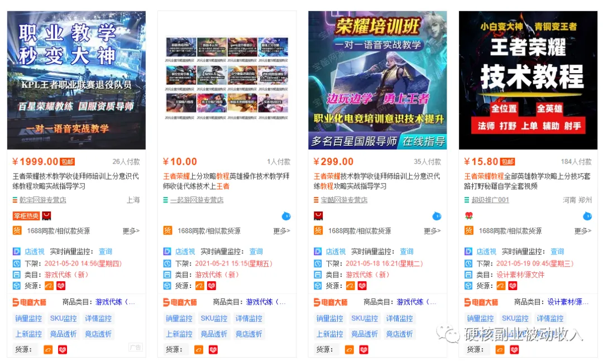
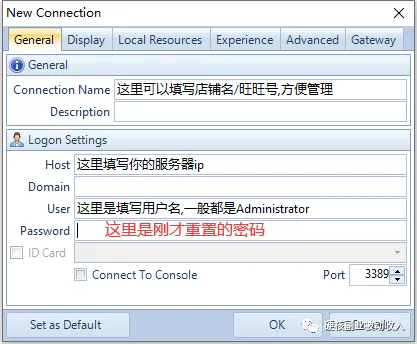

# 淘宝虚拟 
> 此文章的配图大部分的水印是「硬核副业被动收入」，因为我公众号改名了 现在叫「硬核创业笔记」

## 一、淘宝虚拟的基础操作以及介绍
### 0、准备工作
浏览器：QQ浏览器  https://browser.qq.com/
[QQBrowser_Setup_x64.exe]

浏览器插件：至尊宝 http://zzb.3977s.com/
[zzb_edge_chrome_30.2.2.zip]
新手们，最好下载和我同款的浏览器，至尊宝插件下载以后是zip，然后解压出来是一个文件夹 
然后打开QQ浏览器找到「应用中心」

点击管理我的应用，打开开发者模式，然后把插件直接拖进来，就能安装了

点击加载已解压的扩展程序，找到刚才解压的插件目录

### 1、开店
1.打开网址 https://cts.alibaba.com/product/qianniu.htm#work_floor4 下载千牛
[AliworkbenchQNDownload_(1.0.2.1).exe]

2.登录你的淘宝账号
3.点击开店（下图）

有的账号登录进去以后第一个页面就是我要开店，直接点我要开店。

4.一般情况，点击我要开店就已经完成开店要求了，如果你是刚注册的淘宝号，可能需要你用手机淘宝扫码认证一下

### 2、保证金

在这个搜索框里打上 保证金，然后下面有一个快捷功能

新开店铺可以申请保证金的保障，点下就能开通，等你上架产品以后卖出以后，这里待补缴金额如果一直为0就不用问了。

### 3、开通生意参谋
新店30天销售额大约0才可以开通，第二天才会开通，也可以跳过此步骤，生意参谋的作用没那么大了，可以看下个小节 点击跳转 《被动收入功法》

找到数据，找到市场，然后就可以看到领取页面

点击一键领取，会弹出页面点击提交，然后等待半小时左右，开通有延迟。

然后点击30天，在搜索框里输入关键词，就可以挖品了

### 4、找品（重要）
咱们拿「教程」，来展示，可以看到相关搜索词（就是产品的关键词），需求供给比数据越大，表示相关搜索词的商品的市场机会较大。我们可以继续翻第二页，第三页，一直找到咱们感觉可以的关键词，然后拿这个关键词去淘宝去搜索相关品。
教程里的品很多会有版权问题，我现在拿另外一个词来做演示，比如我拿「攻略」这次寻找，找到了一个「黑神话悟空攻略游戏技巧秘籍」，咱们去搜索下淘宝。

点击销量排行，咱们看下销量如何，看前三的销量，根据收货人数，来计算下销售额，如果销售额满足你自己的心理预期，然后产品是否是虚拟产品，如果是，就可以加入到咱们的产品里。
如果前三销量巨大，后面的销量断崖式销量少，就需要考虑下，这类产品竞争相当大，新手的朋友不要碰。
咱们刚才找到的「黑神话悟空攻略游戏技巧秘籍」，加上咱们刚才搜索出来的结果（上图），然后他产品的标题都复制几个出来，「黑神话悟空攻略教程视频游戏通关技巧经验秘籍基础自学电子版资料」
这样咱们就可以得到，「攻略」、「游戏技巧」、「游戏秘籍」、「游戏通关」、「游戏技巧」。。。。。
然后咱们继续拿这些关键词在生意参谋里继续寻找。
以上就是找品的整体逻辑，如果你找到的视频教程类的居多，就需要去查询版权

对了，相关蓝海词里也是可以找到品的。
### 5、主图和详情页的制作
ps的基础学习我这里就不详细说了，就是尽量模仿卖的最好的主图，主图的规格我一般都是用800*800 ，主图是可以放5个的，第一个一般放产品主图，第二张我一般都是放自动发货的说明，第三张一般是放，不满意可以退款之类的图

详情页宽度也是750，高度看你自己做的内容来决定。

详情页的最下面最好放入一些免责声明之类的图片

### 6、上架产品
上架产品之前我们把图片空间开通一下（现在好像不需要开通图片空间了）

在千牛里找到商品，发布商品，从本地上传，

找到产品主图，点击确认下一步

更改类目，类目选择咱们找品类目一直

就是设计素材/源文件类目
然后根据要求填写参数就可以了，这里需要注意几个地方

商家编码可以填写你的模仿的产品id，也可以自己自定义一个编码容易查找和备注，如s001、s002、s003
标题可以直接把对方的标题先抄来用，后期慢慢改
新建一个运费模板

### 7、自动回复
搜索里输入「欢迎语」，点进去

点击售前通用的编辑

把一些常见的问题写在这里面，可以通过长期开店收集到的问题设置在这里面，比如很多人会问怎么发货，你可以在这里面设置，
本店产品均为自动发货
网盘链接均为百度网盘
如果不会使用网盘的慎拍
还可以关联问题，也是设置经常的问题，比如咱们买东西会有

你点击黄色的字，就自动回复你具体问题。
不会设置欢迎语的看下同行，直接搬过来用
### 8、软件的使用
需要用的2款淘宝服务的软件，一个是自动发货，一个是促销软件+自动上下架

1.自动发货

我一般都是用这套套餐，稳定了以后可以半年续费，刚开始就选一个月的吧

购买后返回到这个页面，点击我订购的应用

找到最近购买，然后点击使用，根据他的提示来配置自动发货设置。

在「宝贝内容管理」里设置，自动发货内容

点击添加，然后选中你需要自动发货的产品。

然后把百度网盘链接放进去就可以了，点击保存。
2.超级店长

我店铺用的全是这一个套餐，因为我只需要打折和自动上下架就可以了。

点击促销找到促销工具

然后点击限时折扣

我们选中促销市场，点击下图标注的地方

我一般都是设置89天，因为软件周期是90天。
最后创建完成以后就可以选择你需要打折的产品了，对应设置好价格。

### 9、资源保存以及出单了怎么办
我用的是百度网盘，也可以多弄几个网站，就是现在网盘都需要svip不然放的东西比较少，特别是放一些教程类的，如果不是教程类的空间用的就相当少了，自动发货类的第一次出单了再去同行家下单，然后手动发货，发货后你再去设置自动发货的，这样后面出单就自动发货了。
如果你是服务类的虚拟产品需要自己先测试好自己的技术能否达到要求。

### 10、销量破0
产品上架以后，咱们就密切关注产品的浏览量，如果上架后很快就有流量了，咱们就需要第一时间去给产品销量破0，咱们不需要刷销量过多，破0即可。

## 二、选品深入篇
我知道新手一定会卡在选品上，我们继续拿「游戏攻略」、「游戏秘籍」来举例，如果你不玩游戏也不知道都有什么游戏你可以打开5173.com就可以查询找很多游戏
这些游戏名字+上游戏攻略，比如 「魔兽世界 攻略」、「流浪之路 游戏攻略」等等，这些都属于网络游戏，那是不是单机游戏也可以？
比如上面的「黑悟空」不就是单机游戏吗，那我们不知道单机游戏都有什么怎么办？
是不是有一个叫steam的？
里面的单机游戏不是很多吗，找到游戏名+攻略 继续在淘宝寻找。

这篇文章我们拿「游戏」类的举例，教你如何用一个词来裂变很多个词，上一篇文章里讲解了，如果用生意参谋裂变词，这次是如何通过在淘宝里找目标产品裂变词：
我们找到产品的时候，如「王者荣耀 教程」的时候，这里的教程是不是一个虚拟类的大词？这类产品不可能只有「教程」这一个大词吧?

这个图里是不是「攻略」也是一个主词?「秘籍」是不是一个词?这样算不是裂变出2个虚拟类的词了？
 
裂变后找产品的流程：
这里我们拿「攻略」来找一下产品看看
1.打开生意参谋,搜过攻略,选择30天,用电商大师把词导出来（这个步骤可以跳过）

3.然后我们复制关键词到淘宝里搜下看看
「宝可梦大探险攻略」

「csgo开箱出金攻略」

「一念逍遥攻略」

把这个表格都检测一遍，最少有10个以上的产品就出来了，按照上面的方法我们把「秘籍」也找一遍是不是也会有几个产品就出来了。

关于游戏的，我们不知道游戏名？去各大游戏官方他们都有导航，如「game.163.com」

还有游戏交易平台，如「www.5173.com」
看下名字扔到淘宝里一搜，好的留下，不好的去除，是不是一个店铺的产品就找出来了。

「游戏」只是虚拟类目的一个分支，虚拟产品太多了，我只是拿「游戏」这个词来给大家讲解，找产品的时候也看一下标题里的出现的最多的词，也许你就发现了一个新的虚拟主词了,比如我们刚才找「王者荣耀 教程」的时候,找到了「攻略」「上分」「秘籍」这几个词，虽然没法保证这三个词里都有虚拟产品，但是你多看看是不是也可以增加你的见识。

怎么找不容易违规的品
大家尽量找产品大约3个月的品是做好的，上架时间久说明稳定，具体怎么看需要用到一个插件
「店透视」https://diantoushi.com/help.html
下载插件后安装和至尊宝安装的方式一样

点击一下就可以看到上架时间了。

看到时间了吗，时间越久越好。
当然你不愿意安装插件也可以看商品的评价，看最初的评价的日期也可以获取大概的上架时间
挖品大杀器？
https://data.chinaz.com/keyword

「攻略」这个词就是在这个网站里发现的，没事多点开看看这些，有些关键词你扔到淘宝里一搜，会有惊喜！
https://www.aizhan.com/pccategory/
看到「相声小品」这个词了吗?淘宝搜一下看看

https://www.5118.com/ciku/index

扩展
虚拟词有好多好多，如：攻略、手游、合集、服务、视频、教程、插件、源码、小吃、维修、编程、真题pdf、word、excel、文档、图片、汉化、软件、电子书、教育、学习、甜品、爱好、养殖、摄影、健身、减肥。。。有太多了不介绍了
是不是只有这些词？不是的，这只是一部分，更多的词需要你自己去挖掘，我给你这么多词，你应该可以裂变出很多词出来，找到100个产品都错错有余。

建议
这篇文章以「游戏」为主找的产品，大家可以通过我给的词来找产品，也可以想出其他的词来找产品。
你的任何需求都是可以在淘宝里搜一下的
比如：我的macbook是老版本系统，我想安装某个app结果告诉我系统版本过低，我肯定知道去找低版本的app就可以安装了，但是大多数人知道吗？不知道吧！

这不产品就来了吗！

## 三、版权查询（重要）
查询咱们用一个企查查就足够了 https://www.qcc.com/
比如这个产品

这个产品的关键词就是「组态王」，咱们查询一下

点击这个查商标

看名字的话有可能也就是这2个，咱们分别点申请人看一下

咱们先点第一个进去看一下

咱们可以看到有39个诉讼，点进去具体看看
往下拉可以看到立案信息和开庭信息

看到这里大家也就应该明白了，这个产品会起诉人的，不要去做！！
基本如果里面有著作权纠纷之类的案由，特别是被告人里有 浙江淘宝和上海寻梦（就是拼多多）这2个，基本都不能做，都是会起诉人的品。

## 四、进阶篇（店铺多开，新手可跳过）
店铺多了以后不能都放在本地，我们尽量保持让每个店铺都有独立的ip，这个我们可以租用服务器来解决
1.设置服务器
这里我用腾讯云来演示，https://cloud.tencent.com 登录后，找到产品》轻量应用服务器
点击立即选购

地域只要是大陆就可以，镜像我们可以选择win server 2012()，套餐选择50元的就足够了
点击立即购买

买好以后，我们点击右上角的控制台

点击云产品 》轻量应用服务器
找到刚才买的服务器，点击更多》然后点击管理

然后重置一下密码

设置完密码以后，重启下服务器

然后我们安装一下Remote Desktop Organizer，双击软件以后直接下一步，直接安装。

然后我们打开这个软件，点击添加按钮

按照提示填写内容，然后点击OK

添加完以后，这里就出现刚才添加的，双击就可以打开远程的电脑了

然后我们把千牛的安装包拖进去，直接安装，登录你的店铺。

2.设置子账号
租完服务器以后，把店铺挂到服务器了以后，我们在服务器里操作店铺他会提示你vpn什么的，不能操作，这时候我们需要设置一个超级权限的子账号，然后挂到本地，这样我们退款，上下架以及其他的操作都可以用子账号来操作

打开千牛工作台，右上角有一个搜索功能
输入子账号，点击下面的子账号管理
点击新建员工

岗位可以选择运营，剩下的自己填写一下，然后保存创建

刚添加的子账号是无法用的，需要认证一下，点击认证按照要求用手机淘宝扫码认证一下。
认证完了以后需要设置一下权限，能打勾的都打勾

修改权限里面的能打勾的都打勾

设置子账号的时候，注意设置下退款权限，可以设置成100元，这样子账号就可以给用户退款了，不用登录主账号。
都打完勾了以后，基本子账号就设置完了，然后我们可以本地登录一下子账号，然后设置一下接受订单消息和违规消息
点击消息消息订阅

勾上违规消息提醒

勾上交易消息

这样本地也可以接受订单信息和违规提醒了。

## 五、总结
### 没流量
如果是没流量，请查询你关键词看下，看下其他相关的产品和你自己的产品，是不是主图做到不到位！ 一般连流量都没有基本就是主图不好和没有破0操作（销量0的产品，流量不好，需要补一单）

### 没转化
刚上的产品基本都是没转化的，即使有流量了也不一定有人买，这个时候我们需要破0，就是刷一单，让销量不是0，而且我们的详情页尽量做的详细一些，这样可以提高转化率。
如果再想提高一些转化，主图写上「不满意全额退款」字样，可以打消消费者顾虑，一般都是10块钱的东西，很少人退款。

---

> 我创建了一个「虚拟产品库」，我会把我做的品和可以做的品买过来放到星球里，进了星球里的人可以直接卖。
我还会在星球里分享我的选品思路，文字版和视频版都会分享，包括做虚拟的一些其他细节都会分享进去。
有淘宝虚拟视频教程和内部直播回放

未来「虚拟产品库」里我增加2个板块，一个是「违规库」，一个是「起诉库」。
这样可以提醒或者防止星球里的人违规和被起诉问题。

现在「虚拟产品库」里已经有「淘宝」板块，现在又增加了「小红书」，未来会继续增加「闲鱼」、「拼多多」等平台的详细资料和视频教程。

目前「虚拟产品库」定价599/年，相当于一天才1.6元。

凡是「星球里的朋友」，以后我要是出其他的需要另付费的课程都可以打折。

我的微信：4002945  公众号「硬核创业笔记」